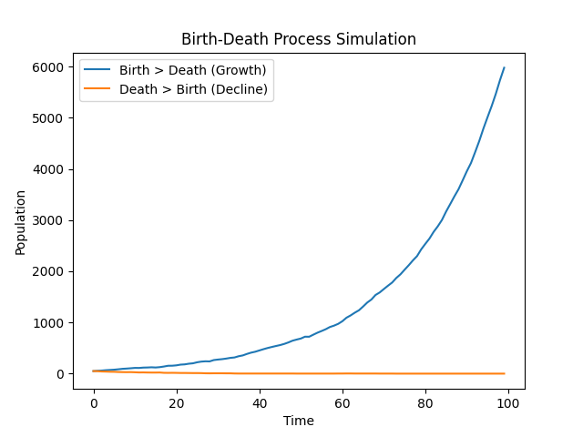

TITLE: GSOC TEST SOLUTIONS 

This repository contains my solutions for the GSoC test tasks (Easy, Medium, and Hard).  
Each task demonstrates understanding of the jsf package, Python–R integration using reticulate, and stochastic simulation concepts.

1. EASY TEST : example.qmd

For the easy task, I created a Quarto file that demonstrates the basic usage of the jsf package.

- Loads the jsf package in R using reticulate
- Shows a simple example workflow
- Follows the structure shown in the official documentation

This file can be rendered using Quarto to view the output as a report.

2. MEDIUM TEST: Python–R Integration using reticulate

For the medium task, I wrote an R script that integrates Python-based jsf functionality using the reticulate package.

- Imports the Python jsf module into R
- Defines initial conditions and reaction rates
- Runs a simulation using the operator-splitting method
- Demonstrates how Python simulations can be controlled from R

This shows how reticulate can be used to bridge both ecosystems smoothly.

3. HARD TEST : Birth–Death Process Simulation
FILE NAME : simualtion.py

For the hard task, I implemented a stochastic birth–death process in Python and visualized the results.

- Simulates population dynamics over time
- Uses random sampling (Poisson process) for births and deaths
- Compares two scenarios:
  - Birth rate > Death rate (growth)
  - Death rate > Birth rate (decline)

RESULTS

HOW TO RUN
begin_src sh
pip install numpy matplotlib
python simulation.py
  
